### Procedure

1. Open the simulator window. Read the general instructions on how to use this tool before starting the simulation. 

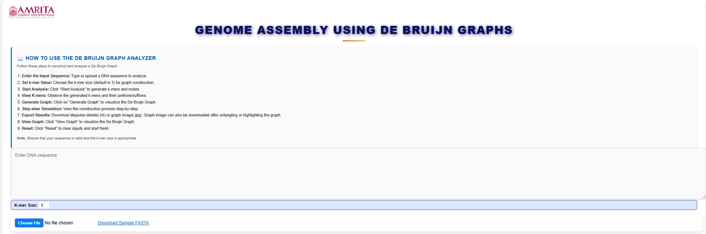
&nbsp;

 

2. To start the experiment, users can enter the DNA sequence of interest. They can also change the k-mer size by clicking the K-mer size box in the simulator window.

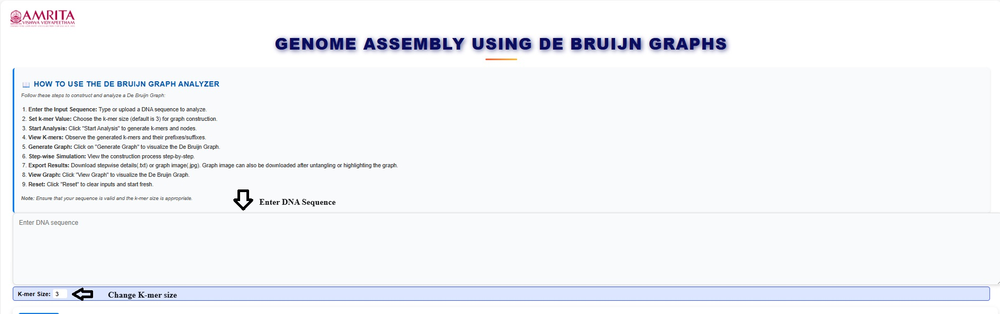
&nbsp;

 
3. To practice the simulator, instead of step 2, users can download a sample DNA file in FASTA format provided in the GUI. 

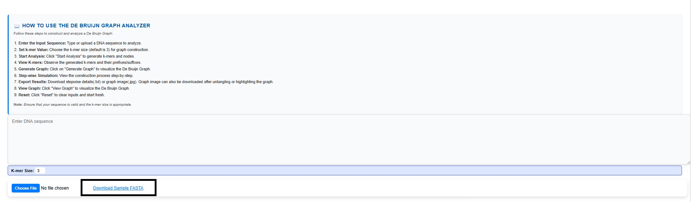
&nbsp;

 
4. Then upload the downloaded file (DNA sequence) by clicking Choose file menu. 

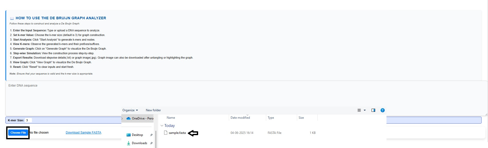
&nbsp;
 

5. When the file is chosen, the DNA sequence gets entered in the text box.

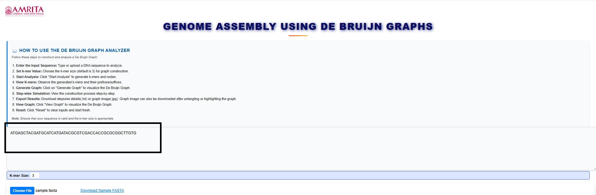
&nbsp;

 
6. Then click on start analysis to visualize the result. Read the basics of the De-Bruijn graph in the box provided in the simulator window. 

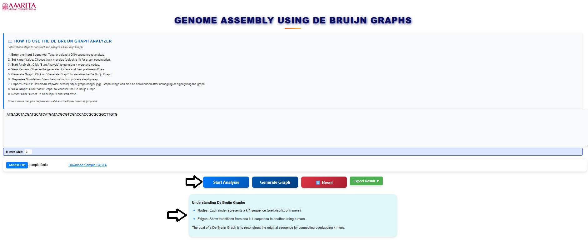
&nbsp;

 
7. The input details are displayed in the GUI. Read and understand the input details.

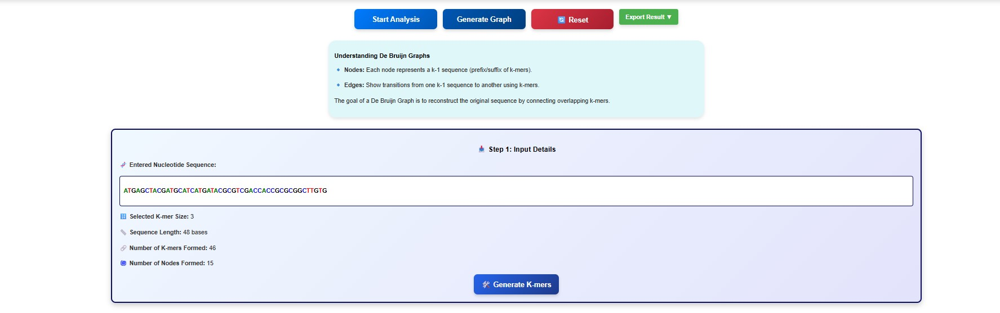
&nbsp;

 
8. Next click on the Generate K mers tab.

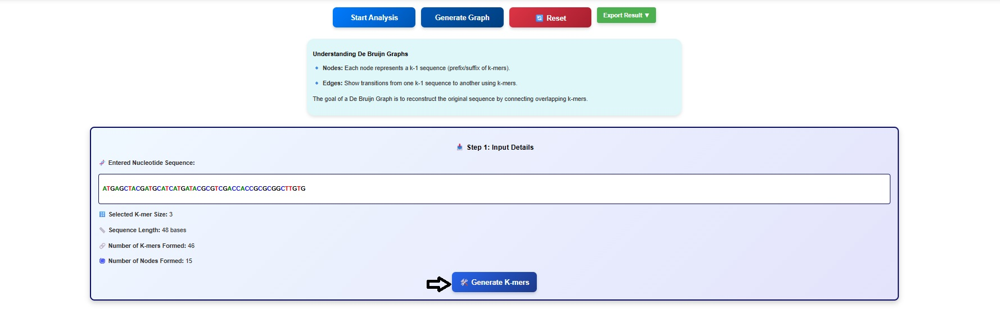
&nbsp;

 
9. The k-mers and its suffix and prefix gets displayed in the simulator window. Users can scroll the window to observe all the k mers and associated suffix and prefix. 

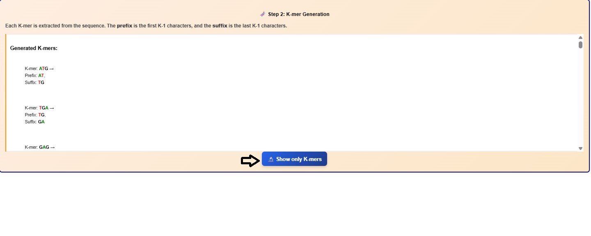
&nbsp;

 

10. Click on the Show only K-mers button to visualize the k-mers.

&nbsp;

 

11.	Click on Show Graph Construct button to observe the nodes. Users can scroll down to observe the list.

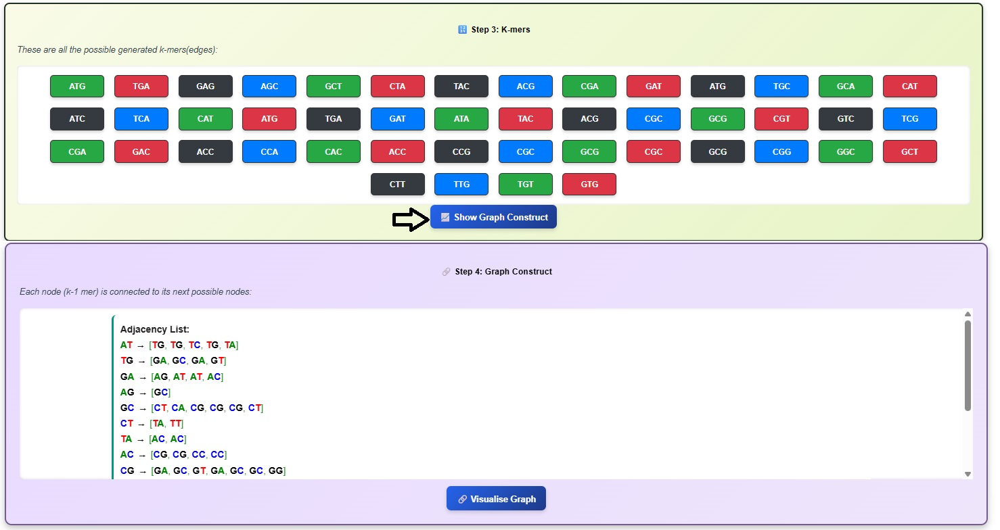
&nbsp;

 

12.	Click on Visualize Graph button to observe De- Bruijn graph.

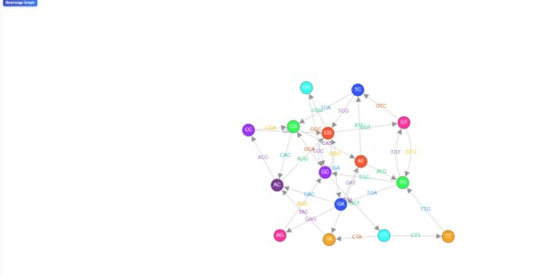
&nbsp;

 
Here the nodes represent (k−1)-mers, and edges represent k-mers. 

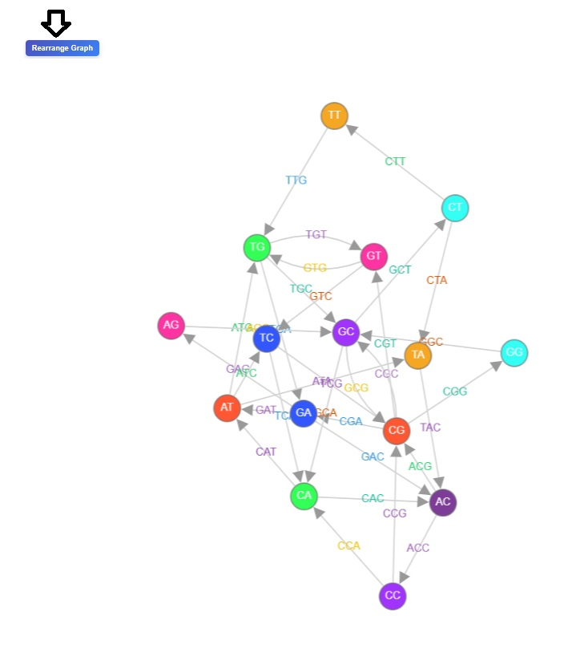
&nbsp;

13.	Users can click on the rearrange button to observed re-arranged version of the De Bruijn graph.

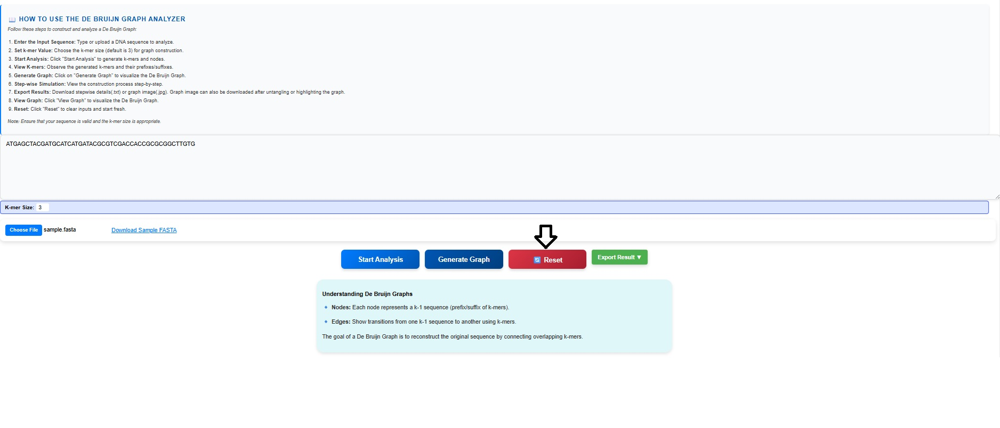
&nbsp;

 
14.	Click on the reset button to re-start the experiment.

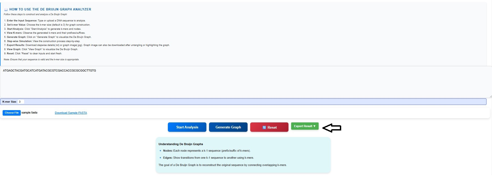
&nbsp;

15.	Click on the Export Result button to get the step-wise construction of the graph and de-Bruijn graph of the provided input sequence. 

