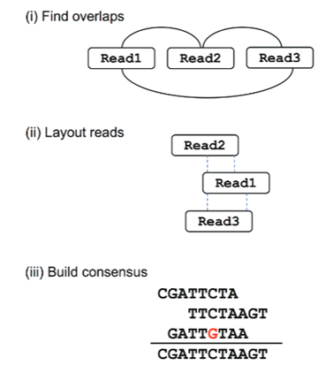

### 
### Introduction
In bioinformatics, sequence assembly has become a crucial challenge due to the growing demand for sequencing approaches and the emergence of next-generation sequencing (NGS) and third-generation sequencing technologies (TGS). Sequence assembly refers to dividing the large pieces of DNA into small pieces and reading the small fragments that constitute the original DNA molecule by connecting the information on various short fragments. In a broader sense, sequence assembly combines the individual reads or fragments into a longer contiguous sequence and recovers a full contiguous sequence. The first attempt for sequence assembly was started in 1970 and later marked a rapid and intensive growth. Several advancements in sequence assembly have emerged that include efficient memory-optimized data structures, de novo assembly strategies for metagenomics, approaches for transcriptome data, and the integration of complementary information from multiple sequencing technologies. Sequence assembly techniques can be divided into three categories in terms of graph construction, namely, overlap-layout-consensus (OLC) approaches with an overlap graph, de Bruijn graph (DBG) methods with a k-mer graph, and greedy algorithms using overlap or a k-mer graph. De Bruijn graph has been widely employed as an advent of massively parallel NGS data.

&nbsp;

### Theory
Sequence assembly is an indispensable task in genome sequencing of new organisms and in studying the structural genomics. That is, assembling DNA sequence fragments is an important step in reconstructing the complete genome sequences of the organisms of interest. Sequence assembly aids in reconstructing a complete genome or transcriptome by assembling short sequencing reads into longer contiguous sequences (contigs). Generally, it is a difficult task as there are many different fragments of the genome that need to be pieced back together in the correct order to make sense of the information. The repetition of nucleotide sequences within the genome also introduces a risk of errors, further complicating the accurate assembly of fragments. The dynamic development of next-generation sequencing (NGS) methods has improved the scope for whole-genome sequencing at a faster pace. Also, with the advances in third-generation sequencing (TGS) technologies provided with reduction in sequencing costs, whole-genome sequencing complexity has shifted from biotechnology to computational analysis. This emphasises the need for DNA fragment reading and sequencing process with efficient computer analysis. Two main computational approaches used for genome assembly are the Overlap-Layout-Consensus (OLC) approach and the De Bruijn Graph (DBG) approach.

&nbsp;

### Overlap-Layout-Consensus (OLC) approach 
The Overlap-Layout-Consensus (OLC) approach is applied for long-read sequencing technologies, such as Sanger sequencing, Pacific Biosciences (PacBio), and Oxford Nanopore Technologies (ONT). This approach has key advantages in de novo genome assembly, where a reference genome is not available. Overlap defines the regions that has two or more DNA sequence reads that share identical or nearly identical nucleotide The OLC approach consists of three primary steps such as Overlap detection, Layout construction, and Consensus generation. In overlap detection Pairwise comparison of all sequencing reads was done to determine overlaps. In an overlap graph, the reads were represented as nodes, and each overlap was represented as edges. For finding sequence similarity, Smith-Waterman or BLAST algorithms were used. In the layout construction step, the reads need to be organized into a consensus sequence. This included construction of a directed graph called an overlap graph or string graph where the edge directions represent relative ordering of reads. In the consensus generation, all reads in a given contig were aligned to create a multiple sequence alignment (Figure 1). A contig represents long, continuous stretches of DNA sequence that were assembled from overlapping short sequencing reads. It is generally formed either during genome assembly or transcriptome assembly and represents regions of sequence that are reconstructed without gaps.

Figure 1. Steps in the Overlap layout consensus approach. Here, overlaps are found between reads, and an overlap graph is constructed where the edges indicate overlapping reads. The reads are converted into contigs based on the overlaps. Here, the dashed lines indicate overlapping portions. Finally, the most likely sequence is chosen to construct a consensus sequence.  

(Adapted from: Ayling, M., Clark, M.D. and Leggett, R.M., 2020. New approaches for metagenome assembly with short reads. Briefings in bioinformatics, 21(2), pp.584-594).

&nbsp;

## De Bruijn Graph (DBG) approach 
The De Bruijn graph (DBG) approach is used for the reconstruction of genomes from short sequencing reads. This method is particularly effective for high-throughput sequencing data, such as data that is generated by Illumina platforms. This method breaks sequences into smaller k-mers that are short overlapping substrings of length k. These k-mers are then used to construct a graph representing all possible ways to be connected to form a genome. A De Bruijn graph is a directed graph where the nodes represent k-mers that are substrings of length k from sequencing reads, and edges are the overlaps of length k-1 between consecutive k-mers. De Bruijn graph assembly works by breaking down the reads into k-mers followed by connecting them based on overlaps, there by reconstructing a complete genome.

Let us consider an example sequence: AGCTGAT. Suppose we choose k = 3; the corresponding k-mers that are generated will be AGC, GCT, CTG, TGA, and GAT. Each of these k-mers overlaps with the next by k-1 bases that form the edges in the graph. The prefix of a k-mer is the first k−1 bases and suffix is the last k−1 bases. Here for k-mer AGC, the prefix is AG and suffix is GC. These are used to establish edges in the De Bruijn graph. The graph structure allows for efficient reconstruction of the original sequence by traversing the edges following a Eulerian path, a path through a graph that traverses each edge once, allowing vertices to be revisited, and starts and ends at different vertices (Figure 2).  

&nbsp;

#### Steps De Bruijn Graph Assembly Algorithm
##### 1. Read Processing and K-mer Generation
In this step, the sequencing reads obtained from high-throughput sequencing platforms are fragmented into overlapping k-mers. Here, the choice of k is most important. If the selected k is too small, the resulting graph will be too connected, creating ambiguity, and if the k is too large, there will be errors due to an increase in the sequencing gaps. 

##### 2. Graph Construction
In the graph, the nodes represent unique k-mers, and edges represent k-1 overlaps between them. The resulting graph will form multiple paths; among them, some will correspond to actual genome sequences.

##### 3. Graph Simplification
This step reduces the complexity of the graph structures by preserving the connectivity. The short, dead-end branches (tips) that likely result from sequencing errors will be removed. Parallel paths that originated due to sequencing errors will be collapsed into a single path. All consecutive non-branching edges will be merged into single edges and final resolutions will be done by using paired-end reads or long reads to resolve any ambiguous path created by genome repeats. 

##### 4. Genome Reconstruction
The Eulerian path is employed to get the output, a sequence that reconstructs the original genome. If any unnecessary sequences are present due to repeats, additional sequencing techniques such as long-read sequencing will be employed for further resolution.

Figure 2. Steps in the De Bruijn Graph Assembly. Here the reads are first decomposed into k-mers. The kmers become vertices in the De-burgin graph, and the edges connect to overlapping kmers. The polymorphisms represented by the red colour form branches in the graph. The numbers above kmers represent the number of times a kmer is seen, and the contigs are built by walking the graph from the edge node.

(Adapted from: Ayling, M., Clark, M.D. and Leggett, R.M., 2020. New approaches for metagenome assembly with short reads. Briefings in bioinformatics, 21(2), pp.584-594).

&nbsp;

### Advantages of De Bruijn graph in sequence assembly

1. This method is efficient for massive, short-read data sets which makes it suitable for next-generation sequencing (NGS) technologies like Illumina.

2. It stores only k-mers, and their connections, reducing memory usage.

3. It is a fast and scalable approach allowing the rapid genome assembly even for large datasets.

4. It has wider applications in whole genome sequencing to assemble prokaryotic, eukaryotic and viral genomes.

5. In metagenomics, it helps to construct genomes from mixed microbial communities in the environment.

6. In RNA sequencing, for transcriptome assembly to reconstruct expressed transcripts.

Apart from these, the challenges in de-Brujin graph assembly are choice of k-mer length, repetitive genomic regions creating loops and cycles in the graph and other sequencing errors that introduce incorrect k-mers .
